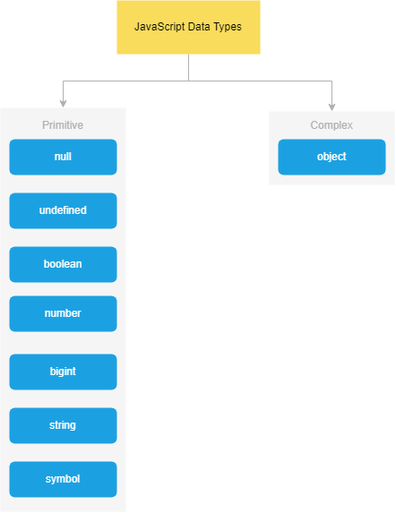

## JavaScript

- is a programming language
- initially designed to interact with elements of web pages.

_Within web browsers, JavaScript consists of three main parts:_

1. ECMAScript
   - provides the core functionality.
2. The Document Object Model (DOM)
   - provides interfaces for interacting with elements on web pages
3. The Browser Object Model (BOM)
   - provides the browser API for interacting with the web browser.

- allows you to add interactivity to a web page.

_Typically, you use JavaScript with HTML and CSS to enhance a web page’s functionality,_ such as

- validating forms,
- creating interactive maps, and
- displaying animated charts.

When a web page is loaded, i.e., after HTML and CSS have been downloaded,

- _the JavaScript engine in the web browser executes the JavaScript code._

  - [ It includes a parser to analyze the code, a compiler to convert it into machine code, and an interpreter to run the compiled code. ]

  - include V8 in Chrome, SpiderMonkey in Firefox, and JavaScriptCore in Safari

_Initially, JavaScript engines were implemented as interpreters._

However, modern JavaScript engines are commonly

- implemented as just-in-time compilers
  - that compile JavaScript code to bytecode
  - for improved performance.

## JavaScript

In 1995, JavaScript was developed by

- Brendan Eich, a Netscape developer.
- Initially named Mocha, it was later renamed to LiveScript.

_Netscape decided to rebrand LiveScript to JavaScript to capitalize on the popularity of Java._

- The decision was made shortly before the release of Netscape Navigator 2 web browser, leading to the introduction of JavaScript version 1.0.

---

Netscape launched JavaScript 1.1 in Netscape Navigator 3.

- In the meantime, Microsoft introduced its web browser called Internet Explorer 3 (IE 3) as a competitor to Netscape.
- However, IE featured its own JavaScript implementation called JScript.
  - Microsoft used the name JScript to avoid potential licensing conflicts with Netscape.

In 1997, JavaScript 1.1 was proposed to the European Computer Manufacturers Association (ECMA) as a proposal.

- Technical Committee #39 (TC39) was assigned the task of standardizing the language,
  - maiming to transform it into a
    - general-purpose,
    - cross-platform, and
    - vendor-neutral scripting language.

_TC39 came up with ECMA-262, establishing a standard for defining a new scripting language called ECMAScript (often pronounced Ek-ma-script)._

_Following that, the International Organization for Standardization and International Electrotechnical Commissions (ISO/IEC) adopted ECMAScript (ISO/IEC-16262)._

<h2 class="wp-block-heading" id="keywords">Keywords &amp; Reserved words</h2>

<p>JavaScript defines a list of reserved keywords that have specific uses. Consequently, you cannot use the reserved keywords as identifiers or property names due to the language rules.</p>

<p>The following table displays the JavaScript reserved words as defined in ECMA-262:</p>

<figure class="wp-block-table"><table><tbody><tr><td><a href="https://www.javascripttutorial.net/javascript-break/"><code>break</code></a></td><td><code>case</code></td><td><code>catch</code></td></tr><tr><td><a href="https://www.javascripttutorial.net/javascript-continue/"><code>continue</code></a></td><td><code>debugger</code></td><td><code>default</code></td></tr><tr><td><a href="https://www.javascripttutorial.net/javascript-if-else/"><code>else</code></a></td><td><code>export</code></td><td><code><a href="https://www.javascripttutorial.net/es6/javascript-inheritance/">extends</a></code></td></tr><tr><td><a href="https://www.javascripttutorial.net/javascript-function/"><code>function</code></a></td><td><code><a href="https://www.javascripttutorial.net/javascript-if/">if</a></code></td><td><code><a href="https://www.javascripttutorial.net/nodejs-tutorial/nodejs-es-module/">import</a></code></td></tr><tr><td><code>new</code></td><td><code>return</code></td><td><code>super</code></td></tr><tr><td><code>throw</code></td><td><code>try</code></td><td><code>null</code></td></tr><tr><td><code>void</code></td><td><code><a href="https://www.javascripttutorial.net/javascript-while-loop/">while</a></code></td><td><code>with</code></td></tr><tr><td><a href="https://www.javascripttutorial.net/es6/javascript-class/"><code>class</code></a></td><td><code>delete</code></td><td><code>finally</code></td></tr><tr><td><code><a href="https://www.javascripttutorial.net/javascript-for-loop/"><code><code>in</code></code></a></code></td><td><code><a href="https://www.javascripttutorial.net/javascript-switch-case/">switch</a></code></td><td><code>typeof</code></td></tr><tr><td><code>yield</code></td><td><code><a href="https://www.javascripttutorial.net/es6/javascript-const/">const</a></code></td><td><a href="https://www.javascripttutorial.net/javascript-do-while/"><code>do</code></a></td></tr><tr><td><code><a href="https://www.javascripttutorial.net/javascript-for-loop/">for</a></code></td><td><code>instanceof</code></td><td><code><a href="https://www.javascripttutorial.net/javascript-this/">this</a></code></td></tr><tr><td><code>var</code></td><td></td><td></td></tr></tbody></table></figure>

<p>In addition to the reserved keywords, ECMA-252 also defines a list of future reserved words that cannot be used as identifiers or property names:</p>

<figure class="wp-block-table"><table><tbody><tr><td><code>enum</code></td><td><code>implements</code></td><td><code>let</code></td></tr><tr><td><code>protected</code></td><td><code>private</code></td><td><code>public</code></td></tr><tr><td><code>await</code></td><td><code>interface</code></td><td><code>package</code></td></tr><tr><td><code>implements</code></td><td><code>public</code></td><td></td></tr></tbody></table></figure>

Variable names follow these rules:
--

- Variable names are case-sensitive.
- Variable names can only contain
  - letters,
  - numbers,
  - underscores, or
  - dollar signs and
  - cannot contain spaces.
- Also, variable names must begin with
  - a letter,
  - an underscore (\_) or
  - a dollar sign ($).
- Variable names cannot use the reserved words.

```
ReferenceError     : counter is not defined
uncaught TypeError : Assignment to constant variable.

```



```js
// -------------------------------------------------------------
// The typeof null
// returns object is a known bug in JavaScript.

// A proposal to fix was rejected
// - due to the potential to break many existing sites.

// -----------------------------------------------------------

// The NaN has two special characteristics:

// - Any operation with NaN returns NaN.
// - The NaN does not equal any value, including itself.

// -----------------------------------------------------------
```

_To convert values of other types into boolean values, you use the Boolean() function._

<figure class="wp-block-table"><table><thead><tr><th>Type</th><th>true</th><th>false</th></tr></thead><tbody><tr><td>string</td><td>non-empty string</td><td>empty string</td></tr><tr><td>number</td><td>non-zero number and Infinity</td><td>0, NaN</td></tr><tr><td>object</td><td>non-null object</td><td>null</td></tr><tr><td>undefined</td><td>&nbsp;</td><td>undefined</td></tr></tbody></table></figure>

```js
console.log(Boolean("Hi")); // true
console.log(Boolean("")); // false

console.log(Boolean(20)); // true
console.log(Boolean(Infinity)); // true
console.log(Boolean(0)); // false

console.log(Boolean({ foo: 100 })); // true on non-empty object
console.log(Boolean(null)); // false
```

## Symbol

JavaScript introduced a new primitive type in ES6: the symbol.

- _Unlike other primitive types, the symbol type does not have a literal form._

Symbol function creates a new unique value every time you call it.

```js
let s1 = Symbol();
console.log(Symbol() == Symbol()); // false
```

## Bigint

ES2020 introduced a new primitive type bigint representing big integer numbers with values larger than 2^53 – 1.

```js
let pageView = 9007199254740991n;
```

## Escaping special characters

To escape special characters, you use the backslash \ character. For example:

- Windows line break: '\r\n'
- Unix line break: '\n'
- Tab: '\t'
- Backslash '\'

## Converting values to string

To convert a non-string value to a string, you use one of the following:

- String(n);
- ” + n
- n.toString()

| _Note that the toString() method doesn’t work for undefined and null._

## JavaScript Primitive vs Reference Values

JavaScript has two different types of values:

- Primitive values
- Reference values

_Primitive values are atomic pieces of data while reference values are objects that might consist of multiple values._

## Stack and heap memory

When you declare variables, the JavaScript engine

- allocates the memory for them on two memory locations:
  - stack and
  - heap.

Because static data has a size that does not change,

- the JavaScript engine allocates a fixed amount of memory space to the static data and
- stores it on the stack
- values
  - Primitive values (null, undefined, boolean, number, string, symbol, and BigInt)
  - Reference values that refer to objects.

```js
// _JavaScript stores objects (and functions) on the heap_
```

```js
let name = "John";
let age = 25;

let person = {
  name: "John",
  age: 25,
};

// JavaScript allocates memory on the stack for the three variables name, age, and person.

// The JavaScript engine creates a new object on the heap memory.
// Also, it links the person variable on the stack memory to the object on the heap memory.

// Because of this, we say that the person variable is a reference that refers to an object.
```
