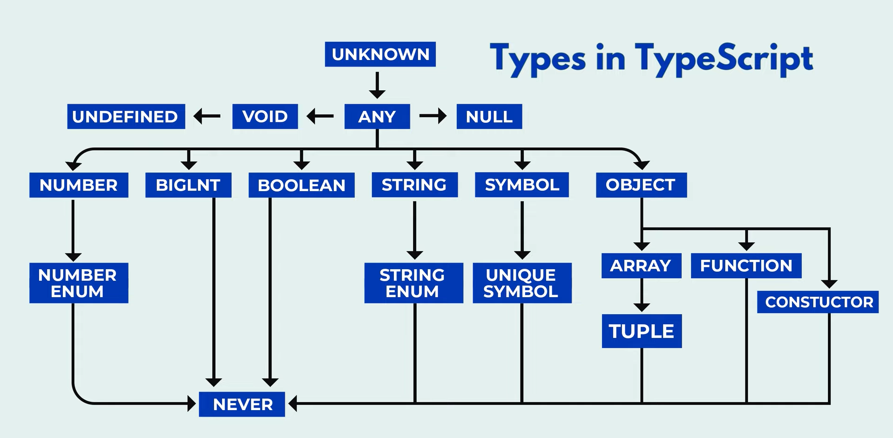

# TypeScript Reference

TypeScript is

- a superset of JavaScript that

  - adds static typing and other features
  - to enhance JavaScript development.

- It was developed by Microsoft on Oct 1, 2012, and is now an open-source project with a large community
  of contributors.

- Extra Features:

  - Interfaces , Tuples, Enums, Generic, Classes. etc.,

- TypeScript catches errors

  - at compile time instead of runtime,
  - which makes debugging easier and
  - reduces the likelihood of bugs in production.

- The main difference between the .ts and .tsx extensions is that

  - the .tsx extension is used for TypeScript files that include JSX syntax,
  - while
  - the .ts extension is used for regular TypeScript files that do not contain JSX

- cmd to Create TS configuration File tsconfig.json

```cmd
    tsc  --init
```

//output

```cmd
    Created a new tsconfig.json with:
                                                                                                                    TS
    target: es2016
    module: commonjs
    strict: true
    esModuleInterop: true
    skipLibCheck: true
    forceConsistentCasingInFileNames: true


    You can learn more at https://aka.ms/tsconfig
```

---

- target: es2016:

  - This means your TypeScript code will be compiled down to ES2016 JavaScript syntax.

- module: commonjs:

  - This sets the module system for your project to CommonJS, which is the module system used by Node.js.

- strict: true:

  - This enables all strict type-checking options.

- esModuleInterop: true:

  - This enables a compiler option that allows default imports from modules with no default export.

- skipLibCheck: true:

  - This makes the compiler skip type checking of declaration files (\*.d.ts).

- forceConsistentCasingInFileNames: true:
  - This ensures that the casing of your file names is consistent to avoid issues on case-sensitive file systems.

---

Complation cmd for TypeScript to JavaScript

```cmd
    tsc
    // to complie all ts file to javaScript

    tsc filename.ts
    // to compile particular file to javaScript
```

cmd to omit compilation in case of error encounter in ts file

```cmd
    tsc --noEmitOnError filename.ts
    // you have to uncommit that in tsconfig.json file
```

## TYPE Annotation

In TypeScript, type annotation is

- a way of explicitly specifying the type of a variable, function parameter, or function return value.

### Advantages

- It helps the TypeScript compiler to - enforce type checking and provide type safety during
  development and . - what operations could we performed on that variable or value

- Type annotations are expressed by using a colon ( : ) followed by - the desired type after the variable or function
  parameter declaration.
- There can be a space after the colon.

## 

## Number Type

- The number type represents numeric values,
  including - integers and floating-point numbers.

```ts
let myFavNum: number = 5;
let myAge: number = 29;
let pi: number = 3.147;
let myNegVal: number = -5;
```

```ts
let invalidResult: number = myAge + "years";
// Type 'string' is not assignable to type 'number'.

let invalidValue: number = "123";
// Type 'string' is not assignable to type 'number'.

let computedValue: number = Math.sqrt(16);
// Valid

let nanValue: number = NaN;
// ?
```

---

## String Type

- Any value under single or double quotes are treated as
  string,
- Also any expression result string as output

```
// To Do
 - substring
 - String Comparision
 - String Template
```

## Boolean Type

In TypeScript, the boolean type represents a value that can be either true or false.

## BigInt Type

- It is a built-in type that allows you to work with numbers
  that are larger than the range supported by the regular number
  type.
- BigInt literals are written by appending the n suffix to an integer literal.
- In JS we can't read the whole numbers beyond 2 ^ 53

```ts
let maxNumber = Number.MAX_SAFE_INTEGER;
let bigNumber: bigint = 9007199254740992n;
console.log(bigNumber);

var anotherBigNumber = BigInt("9007199254740992");
console.log(anotherBigNumber);

let sum = bigNumber + anotherBigNumber;
let difference = bigNumber - anotherBigNumber;
let product = bigNumber * anotherBigNumber;
let quotient = bigNumber / anotherBigNumber;

console.log(sum, difference, product, quotient);
```

```ts
// output

    9007199254740992n
    9007199254740992n
    18014398509481984n 0n 81129638414606681695789005144064n 1n
```

## Any Type

- The any type is the most flexible type in TypeScript.
- It essentially turns off all type checking for the variables or expressions it is applied to.

### useCases

- Working with Dynamic Data:

  - When dealing with data from dynamic sources like user inputs, network responses, or deserialized JSON objects, the any type can be useful.

- Migration from JavaScript:
  - When migrating an existing JavaScript codebase to TypeScript, using the any type can be a convenient way to quickly annotate variables and functions without immediately specifying their precise type

## Unknown Type

- The unknown type is a safer alternative to any because it still enforces type checking and type safety.

- Variables of type unknown can hold values of any type, but you must perform type checks or type assertions before using them in specific ways.

### Function Declaration:

You can declare a function using the " function " keyword, fol lowed by the function_name, a list of parameters enclosed in parentheses, and a return type.

- The function body contains the code that will be executed when the function is called.

### Function Invocation:

To execute a function, you simply invoke it by using its name followed by parentheses.

- You can provide arguments (actual values) for the parameters defined in the function declaration.

### Type INFERNECE

- Type inference in TypeScript
  - refers to the ability of the TypeScript compiler to automatically determine and assign types to variables, expressions, and function
  - return values based on their usage and context in the code.

**What are some best practices for using type
inference in TypeScript**?

- Use type inference for simple cases where the assigned value clearly indicates the intended type.
- When in doubt, provide explicit type annotations to make your intentions clear.
- Avoid relying too heavily on type inference when the assigned value is complex or ambiguous.
- Regularly review and refactor your code to ensure inferred types align with your intentions.

## Optional and Default Parameters:

- TypeScript allows you to define optional and default parameters in functions.

      - Optional parameters are denoted by appending a ? symbol after the parameter_name,

  and - default parameters are specified by providing a default value in the parameter
  declaration.

---

## Type Alias

- In TypeScript, a type alias is a way to give a name to a specific type or combination of types.

  - It allows you to create a custom name for a type,
    - making it easier to reuse and
    - refer to the same type in different parts of your code.
  - Type aliases provide better readability, organization, and abstraction of complex types

- To define a type alias, you use the " type " keyword followed by the alias_name and the type definition:

```ts
type Products{
    name: string;
    price: number;
    quantity: number;
}

cosnt Product1:Products = {
    name:"vinod",
    price: 45,
    quantity:2
}
```

## Call Signature

- A call signature is a function signature that

  - describes

    - the arguments
      - that a function can accept and
    - the type of value it returns.

  - which includes the function's name, parameters, and return type.

- It defines the structure and type information of a function
  - without including the function's implementation or body.

```ts
export type TodosContext = {
  todos: Todo[];
  // Method Call Signature && Industrial Approach
  handleAddToDo: (task: string) => void;

  // Alternate
  (task: string): void;
};
```

## Enums in TS

- Enums in TypeScript are commonly used
  - when you want to represent a set of related values and
  - choose one value from multiple options.
- Enums provide a convenient way to define a set of named values and associate them with specific meanings.

```ts
enum Roles {
  user, //implicitly assign 0
  admin, //implicitly assign 1
}
```

In TypeScript, when enum constants are not
automatically assigned incremental numeric values

- the first enum constant is 0, and
- subsequent enum explicitly assigned numeric values, they are starting from 0. The default numeric value for constants receive values incremented by 1.

```ts
enum Roles {
user: " user" ,
admin: " admin "
}


type LoginDetails ={
name? : string;
email : string;
password : string;
role: Roles
}

const userl : LoginDetails = {
email : " thapaogmail.com" ,
password : " qwqe" ,
role : Roles.admin
}


const user2 : LoginDetails ={
email : "vinodagmail.com" ,
password : " qwe" ,
role : Roles.user
}

const isAdmin: (userl: LoginDetails) => st ... =(userl:LoginDetails):string => {
    const {name,email,role} = user1;
    return role === "admin" ? `${email} is allow to edit the website` : `${email} is not allow to edit the website`
}


 console.log(isAdmin(user1));
 console.log(isAdmin(user2));

```

## TypScript Tuples

- In TypeScript, tuples are a data structure that
  - allows you to store a fixed-size collection of elements of different types.
  - They are similar to arrays, but with a key difference:
    - the types of elements in a tuple are fixed and
    - declared at the time of creation,
    - whereas arrays can holds elements of the same type, and their size can vary.

## Real-life example of using tuples in TypeScript:

Let's consider a senario where you want to represent a person's basic information,

- including their name, age, and whether they have a driver's license.
- Using a tuple can be an appropriate choice because these three elements have a specific order and type.

```ts
// Defining a tuple type for person information
type Personlnfo = readonly [string, number, boolean];

// Example usage
const personl: Personlnfo = ["vinod", 29, true];
const person2: Personlnfo = ["thapa", 17, false];
```

```ts

const displayPersonInfo : (person: Personlnfo) => void =
(person:PersonInfo):void => {
    const [name,age,hasDriverLicense] = person;
    console.log(`Name: ${name}, Age: ${age}, Driver's License: ${hasDriverLicense ? "Yes"
" No "} `);
}

displayPersoInfo(Person1);
displayPersoInfo(Person2);

```

## use of union | (pipe Keyword)

```ts
// if we want to pass to different data type as argument
// we can take help of "|"
const userInput:(value: number | string) => ... = (value: number | string): number | string =>{
    if( typeof.value === 'number'){
        return value * 2;
    }else if(typeof.value === "string"){
        return value.toUpperCase();
    }else{
        throw new Error(message:'Invalid input data');
    }
}
```

```ts
type person = {
  name: string;
  age: number;
};

type employee = {
  emp_id: number;
  department: string;
};
```

```ts
// Union "|" You have to define Either person or employee with all their perspective properties and
// can define other type with first defined type till the no. of properties as you wish to mention
type EmployeeDetails = person | employee;

const Employee: EmployeeDetails = {
  // person Property
  name: "vinod",
  age: 29,

  // employee Property
  emp_id: 1111,
};
```

```ts
// Intersection "&" You Have to Define every properties of Both
type EmployeeDetails = person & employee;

const Employee: EmployeeDetails = {
  name: "vinod",
  age: 29,
  emp_id: 1111,
  deparment: "IT",
};
```

## Generics

Generics in TypeScript allow you

- to create reusable components or functions
  - that can work with multiple data types.

```ts
// Generic function to log and return an input value
function logAndReturn<T>(value: T): T {
  return value;
}

// Using the generic function with different types
const numberResult: number = logAndReturn<number>(45);
const stringResult: number = logAndReturn<string>("HELL FIRE");
const booleanResult: number = logAndReturn<boolean>(true);
```

```ts
// Multiple different type argumentGeneric function to log and return an input value
function logAndReturn<T, U>(a: T, b: U): void {
  console.log(typeof a);
  console.log(typeof b);
}

// Using the multiple different type argument generic function with different types
const numberResult: void = logAndReturn<number, string>(45, "Hell Fire");
```

_when we use generic and non generic type together_

- _then while calling the function_
- _we need to defined the type in a manner_

_but with non generics we don't_

```ts
// We can also define type in non-generic way with generic
function logAndReturn<T, U>(a: T, b: U, c: boolean): void {
  console.log(typeof a);
  console.log(typeof b);
  console.log(typeof c);
}

// define generic type only for generic not for non generic
const numberResult: void = logAndReturn<number, string>(45, "Hell Fire");
```

## Interface

In TypeScript, an interface is a powerful feature that allows you

- to define a contract for an object's shape.
- It specifies
  - the properties and
  - their types
  - that an object must have to be considered of that particular interface type.
- Interfaces are
  - primarily used for type-checking during development and
  - do not generate any JavaScript code at runtime.

```ts
interface Products{
    name: string;
    price: number;
    quantity: number;
}

cosnt Product1:Products = {
    name:"vinod",
    price: 45,
    quantity:2
}
```

## Compiler & Project Configuration

```json

    "rootDir": "./src",                                  /* Specify the root folder within your source files. */

    "outDir": "./dist",                                   /* Specify an output folder for all emitted files. */

    "noEmitOnError": true,                            /* Disable emitting files if any type checking errors are reported. */

```

```cmd
# command similar as nodemon for only one file
tsc filename.ts --watch


# command for all file
tsc -w

# or
tsc --watch
```

```json
    "module": "commonjs",                                /* Specify what module code is generated. */

    "target": "es2022",                                  /* Set the JavaScript language version for emitted JavaScript and include compatible library declarations. */

    "lib": ["es2022","DOM"],                                        /* Specify a set of bundled library declaration files that describe the target runtime environment. */

```
